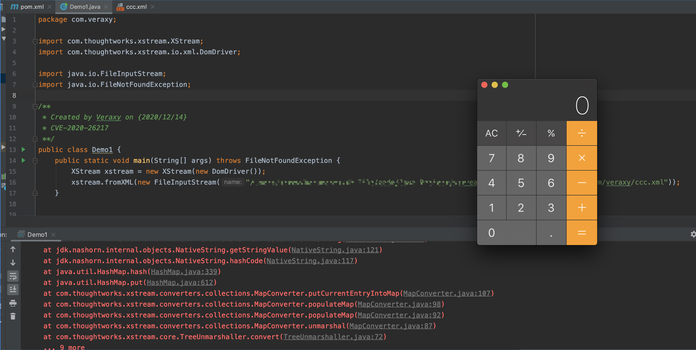
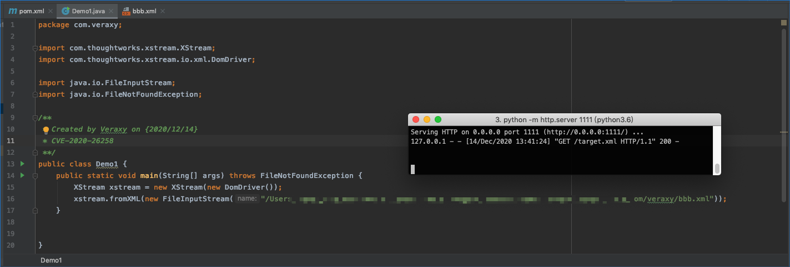
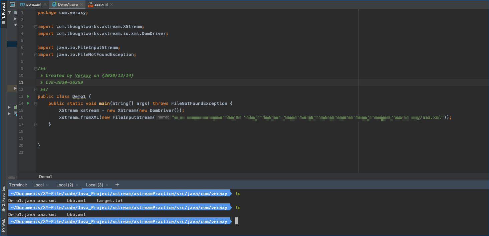

# XStream相关漏洞

XStream今年出的漏洞有 XStream远程代码执行漏洞（CVE-2020-26217）、XStream服务端请求伪造漏洞（CVE-2020-26258）、XStream任意文件删除漏洞（CVE-2020-26259），这里对这些漏洞POC及分析复现环境进行整理。
POC均为以CVE编号命令的xml文件，在Demo.java中引用即可触发。

## CVE-2020-26217
XStream 1.4.13及以前的所有版本存在远程代码执行漏洞，使用 XStream.setupDefaultSecurity()设置白名单安全框架的用户不受影响。

## CVE-2020-26258
XStream 1.4.14及以前的所有版本存在服务端请求伪造漏洞，使用 XStream.setupDefaultSecurity()设置白名单安全框架的用户不受影响。

## CVE-2020-26259
XStream 1.4.14及以前的所有版本存在任意文件删除漏洞，使用 XStream.setupDefaultSecurity()设置白名单安全框架的用户不受影响。

## 参考
https://x-stream.github.io/CVE-2020-26217.html

https://x-stream.github.io/CVE-2020-26258.html

https://x-stream.github.io/CVE-2020-26259.html

https://x-stream.github.io/security.html#framework
